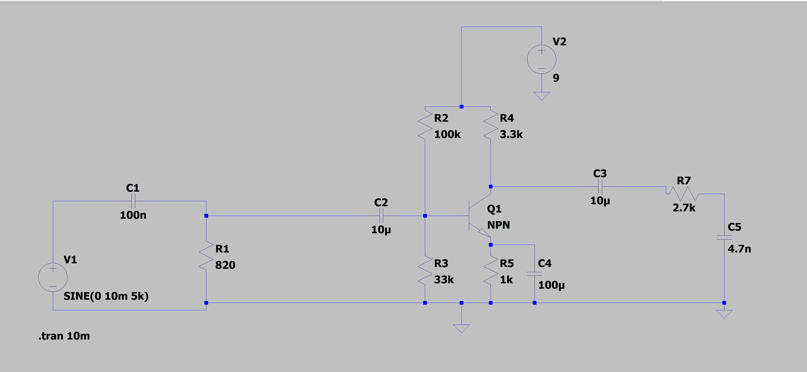
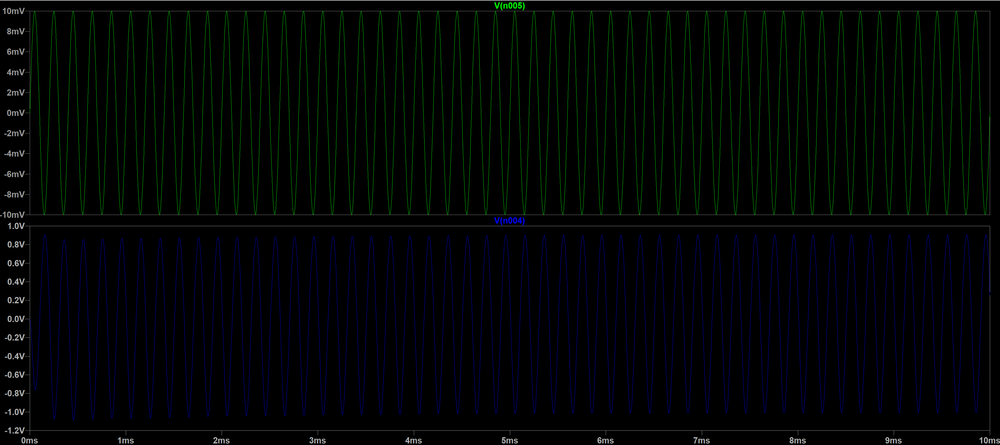

# LTSpice-BJT-Amplifier
A multi-stage amplifier circuit with active high-pass and low-pass filters designed in LTspice.

## Authors
* **Sithumi** - [GitHub Profile Link](https://github.com/sithumi-sanilka) 
* **Ashan** - [GitHub Profile Link](https://github.com/xKingYT) 

## Project Overview
This project involves the design, simulation, and hardware implementation of a multi-stage analog signal conditioning circuit tailored for the audio output section of a basic AM radio. The primary objective is to take a weak, noisy incoming radio signal and process it so that only the desired audio frequency band is passed through and amplified cleanly for the audio output. 

The system is engineered using active BJT components and passive RC networks, operating under a **9V DC power supply**.

---

## Circuit Architecture & Specifications

The circuit processes the incoming signal sequentially through three distinct stages:

### 1. Stage 1: High-Pass Filter (HPF)
*   **Type:** Passive RC High-Pass Filter
*   **Cutoff Frequency ($f_c$):** 2 kHz
*   **Purpose:** Removes low-frequency background noise and DC offsets from the incoming signal, ensuring only the target higher-frequency audio bands pass through.

### 2. Stage 2: Transistor Amplifier
*   **Type:** BJT Common Emitter (CE) Configuration
*   **Target Mid-band Voltage Gain ($A_v$):** $\ge 60$
*   **Purpose:** Provides stable biasing in the active region to massively boost the weak, filtered radio signal to a usable, audible voltage level.

### 3. Stage 3: Low-Pass Filter (LPF)
*   **Type:** Passive RC Low-Pass Filter
*   **Cutoff Frequency ($f_c$):** 12 kHz
*   **Purpose:** Blocks high-frequency RF noise and high-pitched interference, smoothing out the final audio output waveform

---

## Circuit Schematic

## Simulation & Results

